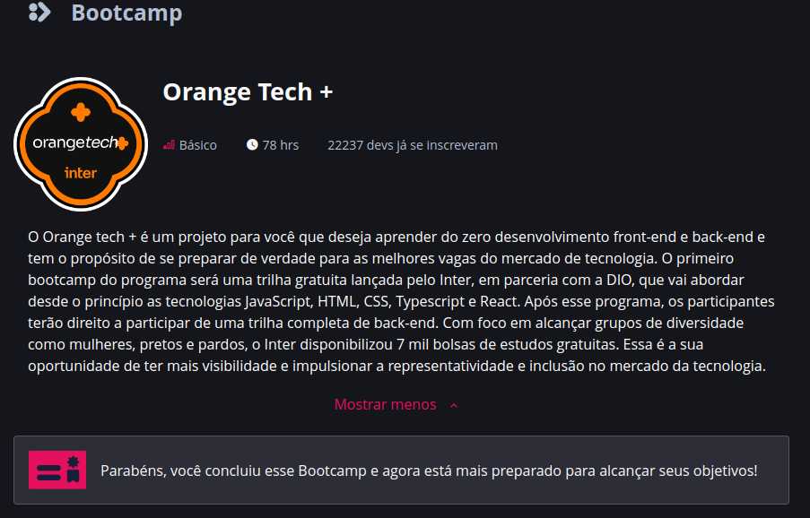
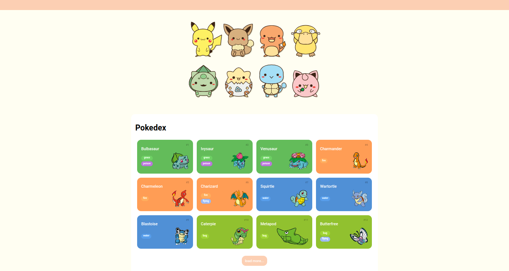
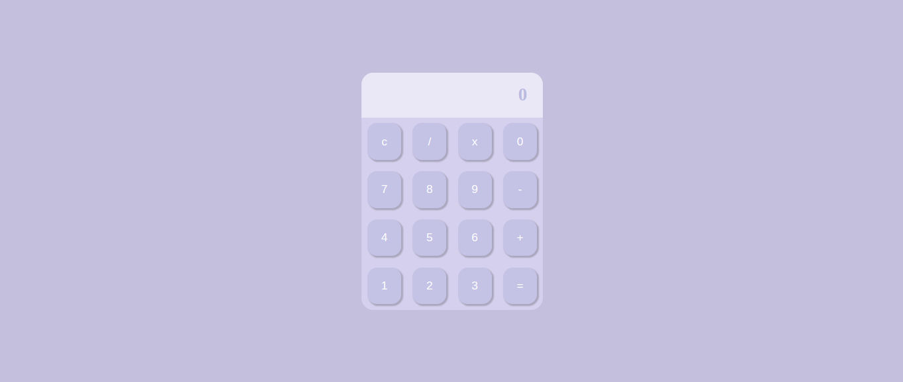
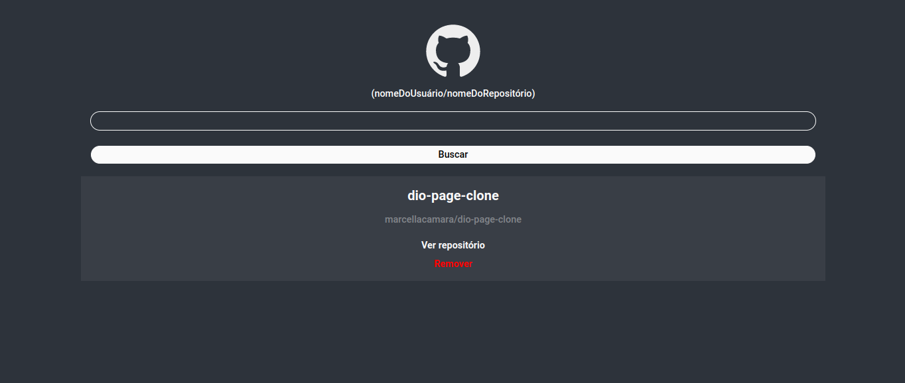

# Orange Tech + Inter

Repositório do Bootcamp Orange Tech+ Inter em parceria com a [DIO](https://www.dio.me/), feito para fins de estudos, incluindo materiais e projetos feitos.

## Anexos

1 - Primeiras páginas interativas com JavaScript

- Variáveis e operadores;
- Estruturas condicionais;
- Funções;
- Objetos e classes;
- Arrays e Estruturas de Repetição;
- Importação e exportação;
- Desenvolvimento Web;
- Protocolo HTTP e Integração com API;

## Projeto prático utilizando API

- Nesse projeto foram utilizadas as stacks HTML, CSS e JavaScript. Para fazer a Pokédex também utilizamos a integração com a API pública [PokéAPI](https://pokeapi.co/).
- O projeto encontra-se em deploy [AQUI](https://marcellacamara.github.io/bootCampOrangeTech/).

2 - Começando na Biblioteca React

- Configuração de Ambiente React;
- Primeiros passos na Biblioteca React;
- Iniciando um Projeto com React CLI e Navegação (react-router-dom);
- Estilização com Styled-Components;
- Trabalhando com Hooks Básicos;
- Trabalhando com Formulários no React;
- Fundamentos do TypeScript;
- Convertendo o Projeto de JavaScript para TypeScript;

  2.1 - Desafio de Projeto: Calculadora com React.

- Utilizando React, a ideia proposta foi de criar uma calculadora, com funcionalidades (somar, subtrair, multiplicar e dividir).
- Para além do desafio, foram utilizados:

  - [Styled Components](https://styled-components.com/);
  - [React Icons](https://react-md.dev/);
  - [Media Queries](https://medium.com/reactbrasil/utilizando-media-queries-no-react-com-styled-components-f0f3160f3f01).

    2.2 Desafio de Projeto: Wiki de Repositórios do GitHub com React.

- Utilizando a [API de repositórios do GitHub](https://docs.github.com/en/rest/repos0), foi feito um projeto onde é possível adicionar e remover repositórios públicos de usuários do GitHub.
- Para além do desafio, foram utilizados:
  - [Styled Components](https://styled-components.com/);
  - [React Icons](https://react-md.dev/);
  - [Media Queries](https://medium.com/reactbrasil/utilizando-media-queries-no-react-com-styled-components-f0f3160f3f01).

    2.3 Desafio de Projeto: Implementando uma Tela de Login com Validação usando TypeScript.

- Tela de Login feita com validação em TypeScript.
- Para além do desafio, foram utilizados:
  - [Styled Components](https://styled-components.com/);

## Stack utilizada

**Front-end:** HTML e CSS

**Back-end:** Vanilla JavaScript, TypeScript e React

## Autores

- Feito por [@marcellacamara](https://www.github.com/marcellacamara).
